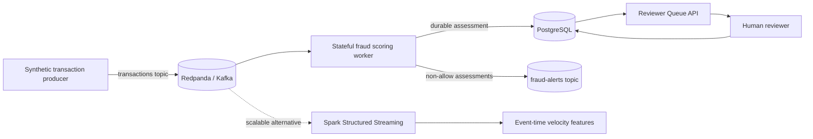

# Fraud Streaming Platform

A runnable **Kafka/Redpanda + stateful scoring + PostgreSQL + human-review API** reference architecture for low-latency fraud detection. The repository also includes a Spark Structured Streaming implementation for scalable event-time/windowed feature computation.

All events and rules are synthetic portfolio examples. No real banking or employer data is included.

## Architecture



## Quick start

```bash
docker compose up --build -d
python -m src.producer --bootstrap localhost:19092 --count 5000
curl 'http://localhost:8000/cases?minimum_risk=0.3&limit=20'
```

Redpanda Console is available at `localhost:8081`, the reviewer API at `localhost:8000`, Kafka externally at `localhost:19092`, and PostgreSQL at `localhost:5433`.

## Streaming semantics

The worker uses a Kafka consumer group with **automatic offset commits disabled**. For each event it:

1. deserializes the transaction;
2. computes stateful fraud signals;
3. persists the assessment to PostgreSQL with `transaction_id` as an idempotency key;
4. commits the database transaction;
5. publishes material non-allow assessments to `fraud-alerts`;
6. commits the Kafka offset only after durable persistence.

That ordering demonstrates the failure boundary rather than pretending `consume → print()` is a production stream processor. The database insert is idempotent so a redelivered transaction does not create duplicate assessments.

## Stateful low-latency features

`src/scoring.py` maintains bounded per-customer history and computes:

- transaction velocity over a 5-minute window;
- amount outlier score relative to customer history;
- rapid country changes within 15 minutes;
- configured elevated-risk merchant categories;
- a saturating composite risk score;
- an evidence/history-dependent confidence estimate;
- actions: `allow`, `monitor`, `step_up_and_review`, `block_and_review`.

The deterministic scorer is easy to unit test and compare with other streaming implementations.

## Spark path

`spark/streaming_job.py` demonstrates Kafka ingestion with an explicit schema, event-time watermarks and sliding-window customer velocity features using Spark Structured Streaming. It represents the scale-out alternative to the single-process stateful scorer.

Important concepts represented here:

**event time vs processing time · watermarks · late events · consumer groups · offsets · at-least-once delivery · idempotent writes · stateful windows · partition keys · stream-to-table materialization.**

## Human review

`app/api.py` exposes a review queue ordered by unresolved status and risk. Review decisions are stored separately from model/scoring output so the system preserves both the machine recommendation and the final human action.

Example:

```bash
curl -X POST http://localhost:8000/cases/tx-0000000123/review \
  -H 'content-type: application/json' \
  -d '{"reviewer_id":"analyst-7","decision":"escalate","reason":"Multiple correlated signals require enhanced review."}'
```

`case_triage.py` provides a separate priority heuristic combining model risk, uncertainty, monetary impact, customer impact and evidence count.

## Failure exercises

```bash
# Stop the database: worker should fail before committing Kafka offsets.
docker compose stop postgres

# Bring it back; uncommitted events can be replayed.
docker compose start postgres

# Inspect topics and consumer lag in Redpanda Console.
```

Discussion points for interviews:

- Why key the Kafka producer by `customer_id`?
- What state breaks if customer events move between partitions?
- Exactly-once Kafka semantics vs application-level idempotency?
- What happens to late events beyond a Spark watermark?
- When should a stream processor publish to a DLQ?
- How would Redis/RocksDB/Flink keyed state change the design?
- How do you prevent a human-review queue from becoming an unbounded operational backlog?

## Cloud mapping

- **AWS:** MSK/Kinesis → Flink/Lambda/ECS → DynamoDB/RDS → SQS/SNS case workflow.
- **GCP:** Pub/Sub → Dataflow → BigQuery/Cloud SQL → Cloud Run review service.
- **Azure:** Event Hubs → Stream Analytics/Flink/Databricks → Cosmos/PostgreSQL → Container Apps.

## CI

GitHub Actions runs Ruff, deterministic scorer/triage tests, validates Docker Compose and builds the service image. Spark is kept as an optional dependency because installing a JVM/Spark runtime is not necessary for every unit-test run.
